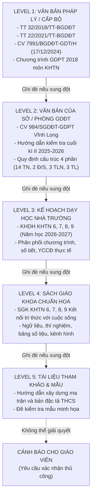
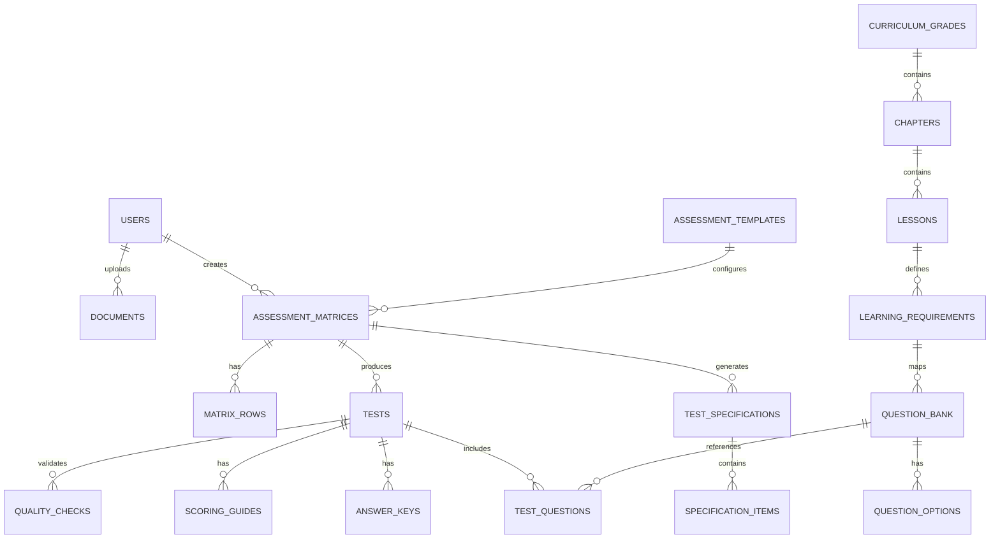

# KHTN ASSESSMENT STUDIO — KIẾN TRÚC HỆ THỐNG VÀ ĐẶC TẢ NGHIỆP VỤ

## 1. SOURCE MAP VÀ THỨ BẬC ƯU TIÊN NGUỒN (5 TIER LEGAL HIERARCHY)

Hệ thống tuân thủ nghiêm ngặt nguyên tắc **Grounding First** & **Priority Resolution**:
Khi có sự mâu thuẫn giữa các tài liệu, hệ thống tự động áp dụng thứ tự ưu tiên sau:



### Danh mục tài liệu đã nạp trong `/knowledge`:
- **Legal**: `11-ctkhoa-hoc-tu-nhien.pdf`, `thong-tu-32-2018-tt-bgddt...pdf`, `cong-van-7991-huong-dan-KiemTraDanhGia.pdf`
- **Local Guidance**: `984_CV-Huong_dan_kiem_tra_cuoi_ki_II-Nam_hoc_2025-2026_4a8e3.pdf`, `YEU CAU KIEM TRA MON KHTN.docx`
- **School Plan**: `KHTN_6-9_Ket_noi_tri_thuc_Chuong_Bai_Phan_mon_So_tiet.docx`, `KẾ HOẠCH DẠY HỌC KHTN 6, 7, 8, 9` (Trường THCS-THPT Phan Văn Trị, Năm học 2026-2027)
- **Textbooks**: SGK KHTN 6, 7, 8, 9 Kết nối tri thức
- **Templates**: Hướng dẫn xây dựng ma trận và bản đặc tả KHTN THCS

---

## 2. DATA DICTIONARY (TỪ ĐIỂN DỮ LIỆU CỐT LÕI)

| Khái niệm | Kiểu dữ liệu | Mô tả / Quy ước | Giá trị mẫu |
| :--- | :--- | :--- | :--- |
| `Grade` | Enum `6 \| 7 \| 8 \| 9` | Khối lớp THCS | `7` |
| `Semester` | Enum `HK1 \| HK2` | Học kì theo năm học | `HK1` |
| `AssessmentType` | Enum | Loại kì kiểm tra định kì | `MID_TERM_1`, `FINAL_TERM_1`, `MID_TERM_2`, `FINAL_TERM_2`, `OTHER` |
| `SubjectArea` | Enum | Phân môn chuyên biệt trong KHTN | `PHYSICS` (Vật lí), `CHEMISTRY` (Hóa học), `BIOLOGY` (Sinh học), `INTEGRATED` (Tích hợp/Mở đầu) |
| `ContentDomain` | Enum | Mạch nội dung GDPT 2018 | `ENERGY_CHANGE` (Năng lượng và sự biến đổi), `SUBSTANCE_CHANGE` (Chất và sự biến đổi của chất), `LIVING_THINGS` (Vật sống), `EARTH_SPACE` (Trái Đất và bầu trời) |
| `CognitiveLevel` | Enum | Mức độ nhận thức (có thể bật/tắt M4) | `M1` (Nhận biết - NB), `M2` (Thông hiểu - TH), `M3` (Vận dụng - VD), `M4` (Vận dụng cao - VDC) |
| `QuestionType` | Enum | 4 dạng thức câu hỏi chuẩn theo CV 7991 & 984 | `MCQ` (Trắc nghiệm nhiều lựa chọn 4 phương án), `TRUE_FALSE` (Trắc nghiệm Đúng/Sai 4 ý a,b,c,d), `SHORT_ANSWER` (Trả lời ngắn / điền số), `ESSAY` (Tự luận) |
| `Periods` | Number (integer) | Số tiết chuẩn của bài học trong KHDH | `2`, `3`, `4` |
| `LearningRequirement` | String / Object | Yêu cầu cần đạt chuẩn theo CT 2018 | `"Nêu được khái niệm tế bào. Nêu được hình dạng và kích thước của một số tế bào..."` |
| `ItemScore` | Number (float) | Điểm số của từng câu hỏi | MCQ: 0.25; TRUE_FALSE: 0.25/ý (tổng 1.0/câu nếu 4 ý); SHORT_ANSWER: 0.5; ESSAY: linh hoạt |

---

## 3. DATABASE SCHEMA (POSTGRESQL / SUPABASE)



---

## 4. FULLSTACK NEXT.JS ARCHITECTURE & MODULES

```
/
├── app/                       # Next.js App Router
├── components/                # UI Components (shadcn & assessment widgets)
├── features/                  # Business logic engines:
│   ├── matrix-engine/         # Phân bổ ma trận cân bằng số tiết, 3 mạch
│   ├── spec-engine/           # Ánh xạ ma trận -> bản đặc tả
│   ├── question-engine/       # Constraint matching & AI generation
│   ├── quality-gate/          # Bộ kiểm tra 14 tiêu chuẩn
│   └── export-engine/         # Xuất DOCX / XLSX thể thức chuẩn
├── lib/                       # AI abstraction, Supabase client
├── database/                  # SQL migrations & seeds
├── knowledge/                 # Knowledge Base 5 tiers
├── prompts/                   # Versioned AI prompts
└── tests/                     # Unit, Integration, E2E tests
```
